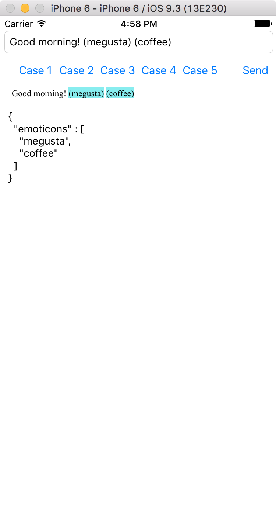
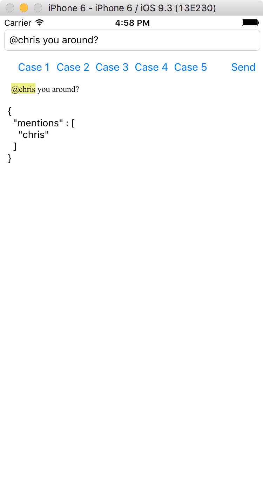
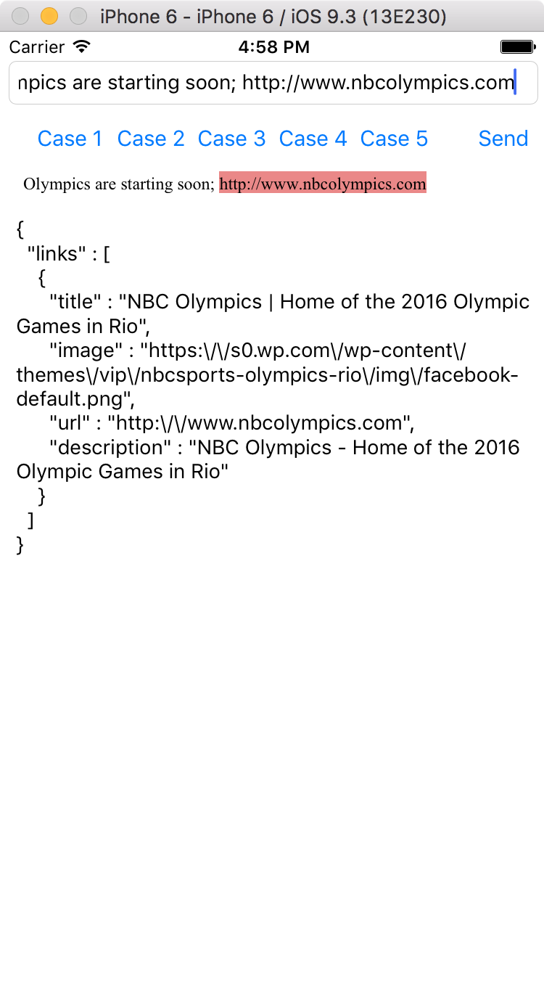
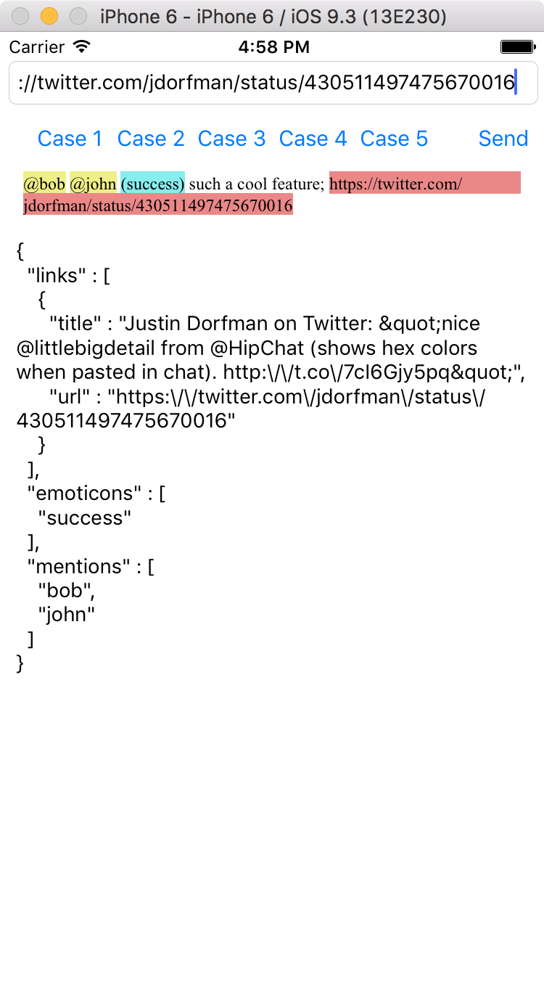
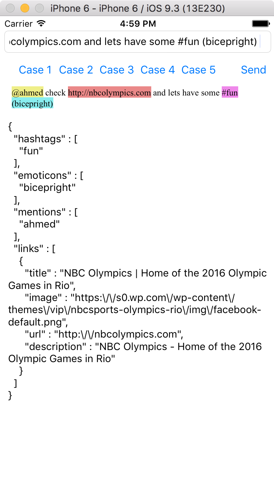
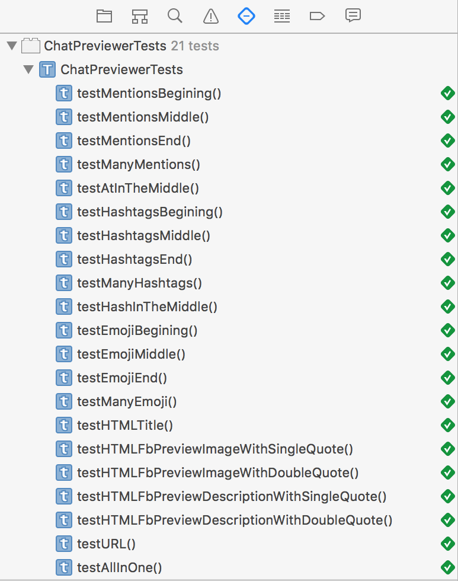

# ChatPreviewer
The module should help extracting Hashtags, mentions and URLS, if URL found it will start looking for Description and Image that usually used in FB preview

-
Input: "@chris you around?"

Return (string):
{
  "mentions": [
    "chris"
  ]
}
 
-
*Input*: "Good morning! (megusta) (coffee)"

*Return (string)*:
{
  "emoticons": [
    "megusta",
    "coffee"
  ]
}

-
*Input*: "Olympics are starting soon; http://www.nbcolympics.com"

*Return (string)*:
{
  "links": [
    {
      "url": "http://www.nbcolympics.com",
      "title": "NBC Olympics | 2014 NBC Olympics in Sochi Russia"
    }
  ]
}
 
-
*Input*: "@bob @john (success) such a cool feature; https://twitter.com/jdorfman/status/430511497475670016"

*Return (string)*:
{
  "mentions": [
    "bob",
    "john"
  ],
  "emoticons": [
    "success"
  ],
  "links": [
    {
      "url": "https://twitter.com/jdorfman/status/430511497475670016",
      "title": "Twitter / jdorfman: nice @littlebigdetail from ..."
    }
  ]
}

___

#Here is the module logic
- TextProcessor is Observer, each specific text processor should be registered to get notified when a Text is being processed.
- TextProcessExtension is the protocol used.

I have added 
- MentionsProcessor
- HashtagProcessor
- EmoticonProcessor
- URLProcessor

Because it is required to have the URL title, I had to add a new layer which is fetching the URL page and parse it to extract Title + FB Preview elements (Image and Description), accordingly I develop more extensions for it
- HTMLTitleProcessor
- HTMLImageProcessor
- HTMLDescriptionProcessor

So When the URLProcessor finds URL it initiate page download and creates its own TextProcessor with different extensions registered (HTML****Processors)

The result is Dictionary that contains key for each processor and array of what is found.

-

    
	
Emoticon

    
	
Mentions

    
	
URL

    
	
Mentions, emoticon and URL

    
	
Hashtags, Mentions, emoticon and URL 

    
	
Test cases 

